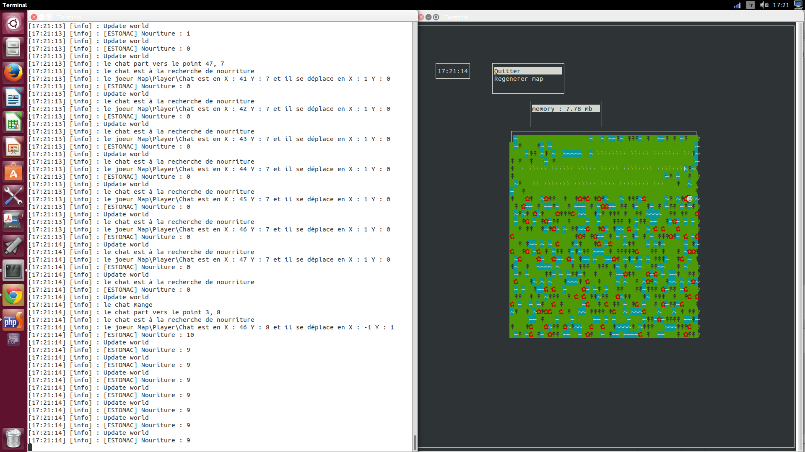

IA PHP
------

Cette inteligence artificiel est représenté par un chat sur une map.

Le premier palier est la représentation des bas instincs :
 - Recherche de nouriture
 - Etc...

Cette démonstration est visualisable en console et en mode web.

Pour la console nous vous conseillons d'installer l'extension php ncurses pour une meuilleur expérience car elle permet une meuilleur gestion de l'affichage.

En console : ./console
En mode web : ./web

Voici une capture

